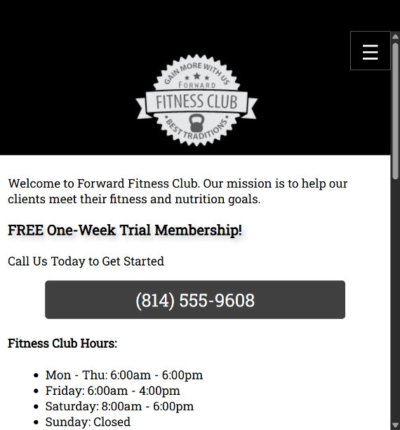

# Forward Fitness Club

A five-page fitness club demonstration developed by **Daniel Pena Arias** throughout a semester of web development coursework.



## Overview

This course project practices building a multi-page website with HTML, CSS, and vanilla JavaScript. It presents a fictional fitness club with exercise information, a class schedule, nutrition content, and a demonstration inquiry form.

## Features

- Responsive layouts for mobile, tablet, and desktop screens.
- Shared site navigation and keyboard-accessible mobile menu controls.
- Class schedule table and mobile schedule summary.
- Video and audio elements, with supplied caption and description tracks.
- JavaScript controls that switch exercise demonstration videos.
- Form labels, required fields, checkboxes, and a selection list.
- Visible demo feedback without sending or storing form entries.

## Run locally

For reliable video and text-track behavior, serve the project folder:

```sh
python -m http.server 8000
```

Visit `http://localhost:8000`. There is no build step or package installation. Google Fonts and the embedded map require internet access.

## Project structure

```text
index.html        Home
about.html        Facilities and exercise videos
classes.html      Schedule and audio sample
nutrition.html    Nutrition content
contact.html      Demonstration inquiry form
css/              Shared stylesheet
scripts/          Menu, exercise, and form behavior
images/           Course project graphics
media/            Audio, video, captions, and descriptions
docs/             Screenshots and project notes
```

## Coursework and maintenance

This is a guided semester project, not a commissioned business website. It uses course-supplied material. It demonstrates my implementation and practice with core web technologies rather than an entirely original commercial design.

In September 2026, ChatGPT assisted with portfolio organization and focused repairs: media paths, form markup and demo behavior, skip links, accessible controls, and the schedule header. See [CREDITS.md](CREDITS.md) and [portfolio changes](docs/CHANGES.md).

## Demo limitations

- The form does not create memberships or send messages.
- Business contact details and social links are sample coursework content.
- The mobile and desktop class schedules are maintained separately in the original course design.
- External websites and the embedded map are outside this project's control.

## Deployment

Serve these files directly from a static host. The repository includes `.nojekyll` for GitHub Pages compatibility. Source repository: https://github.com/danpena27/forward-fitness-club.
